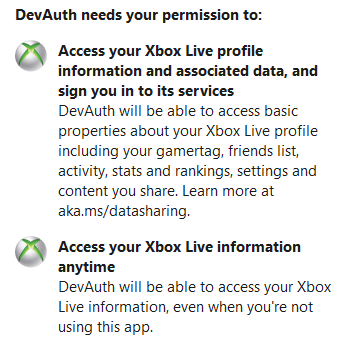

# The Minecraft Microsoft account migration does more harm than good

## Terrible OAuth Scopes

To request access to generate sessions for the minecraft account linked with a microsoft account, you need the scopes
`XboxLive.signin XboxLive.offline_access`, which presents the following scope screen to the user:

What this screen fails to mention is that it gives the app access to **GENERATE** minecraft session tokens until (and potentially after) you revoke its 
access. So instead of phising for account credentials with a fake login, you can just use oauth to get them. To make matters worse, Hypixel's system
for verifying users have a microsoft account (required for some games), uses these scopes. While I trust hypixel doesn't store the gathered sessions
and only uses them to verify uses as they say, if accepting this scope screen becomes normal, less trustworthy servers may harvest accounts under
the disguise of verifying microsoft accounts.

If microsoft had thought out the new system at all they would have come up with a system similar to the following (my proposed solution):

| Scope | Details |
|---|---|
| `minecraft.id` | Get a users minecraft UUID and username |
| `minecraft.auth` | Get the ability to generate sessions for a user |

Each scope would have a clear description of what it does, and revoking the 2nd would immediately prevent generating sessions and
invalidate all current sessions generated by that app.

With the current system, it's not documented how long an app can generate sessions for before needing to complete oauth again or what effects
revoking access has.

## Alt Accounts

Many people have 1 or more "alt" accounts. These accounts are used for recording videos from a 2nd perspective, testing things, or simply going incognito.
With the migration, you can only link one minecraft account to each microsoft account, meaning for each alt you need to create a microsoft account.
I know from experience that microsoft loves to randomly lock "suspicious" accounts, requiring a unique, non virtual/voip phone number to regain access.
Say that you are migrating 3 alts, creating 3 micorsoft accounts in a row would almost certainly trigger some automated "abuse" detection resulting in
the locking of all 3 accounts, requiring 3 unique, real phone numbers to unlock them. If this has happened to you, please let me know so I can
update this to include that story. 

## The Capes

Capes have always been a vanity item and with the new EULA, the only capes allowed are official ones. Why they will give a cape to every of the millions
of accounts that will migrate is beyond me. The only good thing with the capes is you can easily check if someone has migrated, however if they bought an
account since migration was announced, its already microsoft and they don't have a cape so the oauth approach decribed above is neccesary.

C'mon microsoft, atleast make the capes be different depending what year you purchased the game.

## Harder for modders and developers

Modders and developers have undeniably contributed enormously to Minecraft's continued success and the least Microsoft could do is not fuck them
with a terribly overcomplicated and hard to implement authentications system. There isn't much more to be said here other than a big thanks to everyone
who helps reverse engineer their overcomplicated system for the benefit of everyone.

## Less transparent authentication flow

With the mojang authentication flow there was a series of simple endpoints for logging in, logging out, chaning skin, etc. With the microsoft flow, there
are many unknowns around how long tokens/refesh tokens are good for and what can be done to revoke them. While these things will be found over time
with trial and error, being able to have them documented officialy would be such much better for everyone. 

## Its not all bad

This microsoft migration did do some things right, such as bringing minecraft account security up to a modern level allowing for 2fa/mfa and automated
security checks (new ip detection etc). However, the issues I have outlined here lead me to believe that the microsoft migration has caused more harm
than good. If you agree with me, good. If you disagree with me, also good. If you've found any mistakes (gramatical or with the content) please open an
issue or pull request.
